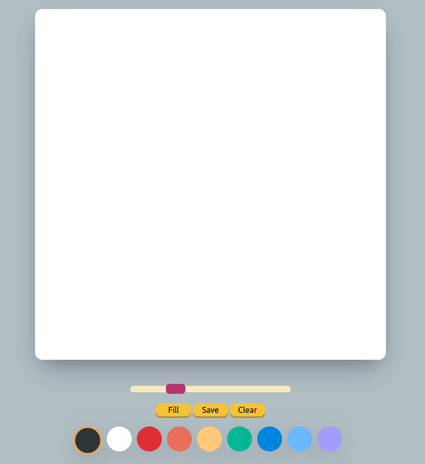

# PaintJS

> VanillaJS로 만든 그림판

VanillaJS로 Painting Board 만들기 프로젝트

## 기능

- 그리기
- 브러쉬 크기 변경
- 브러쉬 색상 변경
- 캔버스 색 채우기
- 캔버스 화면 지우기
- 이미지 저장하기
- 마우스 포인터 모양 변경

## 링크

PaintJS: <https://hshine1226.github.io/paintjs/>
